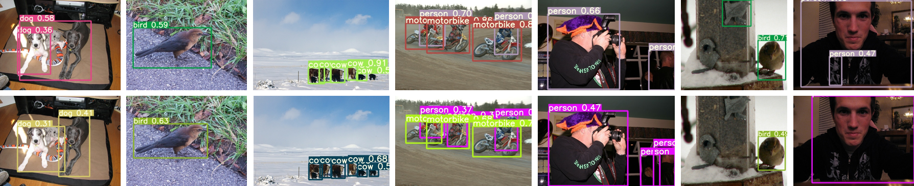
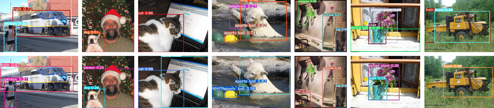

# Alpha-IoU: A Family of Power Intersection over Union Losses for Bounding Box Regression

YOLOv5 with alpha-IoU losses implemented in PyTorch.

Example results on the test set of PASCAL VOC 2007 using YOLOv5s trained by the vanilla IoU loss (top row) and the alpha-IoU loss with alpha=3 (bottom row). The alpha-IoU loss performs better than the vanilla IoU loss because it can localize objects more accurately (image 1 and 2), thus can detect more true positive objects (image 3 to 5) and fewer false positive objects (image 6 and 7).
<p align="center">

</p>

Example results on the val set of MS COCO 2017 using YOLOv5s trained by the vanilla IoU loss (top row) and the alpha-IoU loss with alpha=3 (bottom row). The alpha-IoU loss performs better than the vanilla IoU loss because it can localize objects more accurately (image 1), thus can detect more true positive objects (image 2 to 5) and fewer false positive objects (image 4 to 7). Note that image 4 and 5 detect both more true positive and fewer false positive objects.
<p align="center">

</p>

## Citation

If you use our method, please consider citing:

```
@inproceedings{Jiabo_Alpha-IoU,
  author    = {He, Jiabo and Erfani, Sarah and Ma, Xingjun and Bailey, James and Chi, Ying and Hua, Xian-Sheng},
  title     = {Alpha-IoU: A Family of Power Intersection over Union Losses for Bounding Box Regression},
  booktitle = {NeurIPS},
  year      = {2021},
}
```

## Modifications

This repository is a fork of [ultralytics/yolov5](https://github.com/ultralytics/yolov5), with an implementation of alpha-IoU losses while keeping the code as close to the original as possible.

### Alpha-IoU Losses

Alpha-IoU losses can be configured in Line 131 of [utils/loss.py](https://github.com/Jacobi93/Alpha-IoU/blob/main/utils/loss.py), functionesd as 'bbox_alpha_iou'. The alpha values and types of losses (e.g., IoU, GIoU, DIoU, CIoU) can be selected in this function, which are defined in [utils/general.py](https://github.com/Jacobi93/Alpha-IoU/blob/main/utils/general.py). Note that we should use a small constant epsilon to **avoid torch.pow(0, alpha) or denominator=0**.

### Install

[**Python>=3.6.0**](https://www.python.org/) is required with all
[requirements.txt](https://github.com/Jacobi93/Alpha-IoU/blob/main/requirements.txt) installed including
[**PyTorch>=1.7**](https://pytorch.org/get-started/locally/):
<!-- $ sudo apt update && apt install -y libgl1-mesa-glx libsm6 libxext6 libxrender-dev -->

```bash
$ git clone https://github.com/Jacobi93/Alpha-IoU
$ cd Alpha-IoU
$ pip install -r requirements.txt
```

### Configurations

Configuration files can be found in [data](https://github.com/Jacobi93/Alpha-IoU/tree/main/data). We do not change either 'voc.yaml' or 'coco.yaml' used in the original repository. However, we could do more experiments. E.g.,

```
voc25.yaml # randomly use 25% PASCAL VOC as the training set
voc50.yaml # randomly use 50% PASCAL VOC as the training set
```

Code for generating different small training sets is in [generate_small_sets.py](https://github.com/Jacobi93/Alpha-IoU/blob/main/generate_small_sets.py). Code for generating different noisy labels is in [generate_noisy_labels.py](https://github.com/Jacobi93/Alpha-IoU/blob/main/generate_noisy_labels.py), and we should change the 'img2label_paths' function in [utils/datasets.py](https://github.com/Jacobi93/Alpha-IoU/blob/main/utils/datasets.py) accordingly.


## Implementation Commands

For detailed installation instruction and network training options, please take a look at the README file or issue of [ultralytics/yolov5](https://github.com/ultralytics/yolov5). Following are sample commands we used for training and testing YOLOv5 with alpha-IoU, with more samples in [instruction.txt](https://github.com/Jacobi93/Alpha-IoU/blob/main/instruction.txt).

```
python train.py --data voc.yaml --hyp hyp.scratch.yaml --cfg yolov5s.yaml --batch-size 64 --epochs 300 --device '0'
python test.py --data voc.yaml --img 640 --conf 0.001 --weights 'runs/train/voc_yolov5s_iou/weights/best.pt' --device '0'
python detect.py --source ../VOC/images/detect500 --weights 'runs/train/voc_yolov5s_iou/weights/best.pt' --conf 0.25
python detect.py --source inference/images --weights 'runs/train/voc_yolov5s_iou/weights/best.pt' --conf 0.25
```

We can also randomly generate some images for detection and visualization results in [generate_detect_images.py](https://github.com/Jacobi93/Alpha-IoU/blob/main/generate_detect_images.py).

## Pretrained Weights

Here are some pretrained models using the configurations in this repository, with alpha=3 in all experiments. Details of these pretrained models can be found in [runs/train](https://github.com/Jacobi93/Alpha-IoU/tree/main/runs/train). All results are tested using 'weights/best.pt' for each experiment. It is a very simple yet effective method so that people are able to quickly apply our method to existing models following the 'bbox_alpha_iou' function in [utils/general.py](https://github.com/Jacobi93/Alpha-IoU/blob/main/utils/general.py). Note that YOLOv5 has been updated for many versions and all pretrained models in this repository are obtained based on the [YOLOv5 version 4.0](https://github.com/ultralytics/yolov5/releases), where details of all versions for YOLOv5 can be found. Researchers are also welcome to apply our method to other object detection models, e.g., Faster R-CNN, DETR, etc.

 - [The IoU loss for YOLOv5s on PASCAL VOC](https://github.com/Jacobi93/Alpha-IoU/blob/main/runs/train/voc_yolov5s_iou/weights/best.pt)
 - [The alpha-IoU loss for YOLOv5s on PASCAL VOC](https://github.com/Jacobi93/Alpha-IoU/blob/main/runs/train/voc_yolov5s_3iou/weights/best.pt)
 - [The DIoU loss for YOLOv5s on PASCAL VOC](https://github.com/Jacobi93/Alpha-IoU/blob/main/runs/train/voc_yolov5s_diou/weights/best.pt)
 - [The alpha-DIoU loss for YOLOv5s on PASCAL VOC](https://github.com/Jacobi93/Alpha-IoU/blob/main/runs/train/voc_yolov5s_3diou/weights/best.pt)

